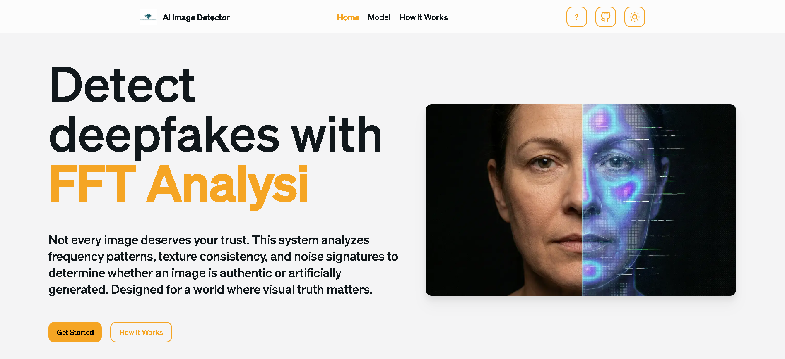
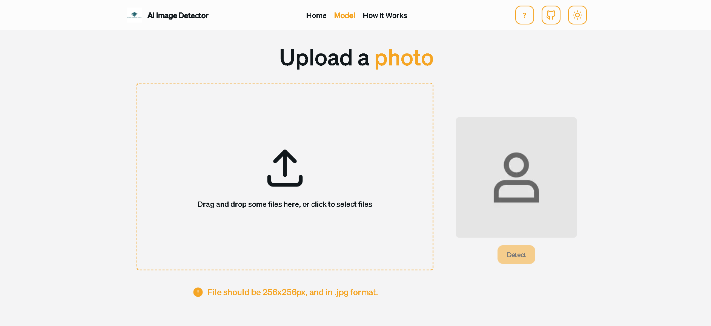
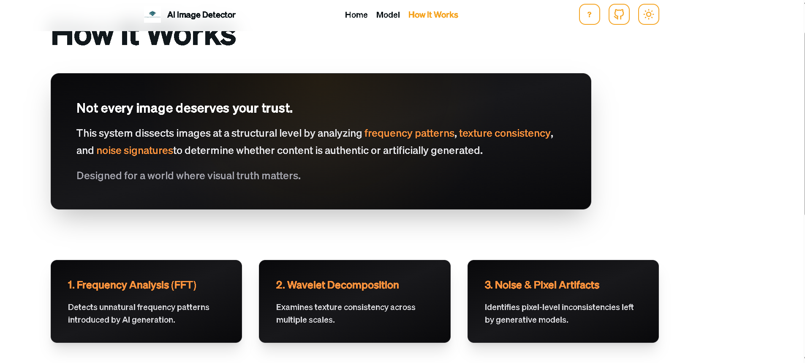

<br/>
<p align="center">
  

  <h2 align="center">AI Image Authenticity Detector</h2>

  <p align="center">
    An AI-based system to detect real vs AI-generated images using image forensics.
    <br/>
    <br/>
    <b>Live Demo:</b> NOT DEPLOYED
  </p>
</p>

---

## 📌 About The Project

**AI Image Authenticity Detector** is a student-built system designed to analyze images and determine whether they are **real** or **AI-generated**.

Instead of relying on heavy deep learning models, this project focuses on **image forensics techniques** combined with **classical machine learning**, making it lightweight, explainable, and suitable for real-world deployment.

The system is built to handle the growing problem of **AI-generated misinformation** and visually deceptive content.

> ⚠️ This project was developed as a **student project for learning and demonstration purposes**.

---

## ✨ Key Features

- 🔍 **Image Forensics Analysis**
  - Frequency-domain analysis using FFT
  - Texture analysis using Wavelet Transform
  - Pixel-level noise and artifact detection

- 🧠 **Hybrid Decision System**
  - Classical ML models (Logistic Regression & Random Forest)
  - Statistical probability engine
  - Final decision based on confidence-weighted fusion

- 🔁 **Smart API Fallback**
  - External Sightengine API is used **only when confidence is low**
  - Reduces dependency on third-party services

- 🌐 **Web-Based Interface**
  - Clean and modern UI
  - Image upload and instant prediction
  - Clear confidence and prediction output

---

## 🛠️ Built With

### Backend
- **Python**
- **FastAPI**
- **Scikit-learn**
- **NumPy / OpenCV**
- **Custom Image Forensics Pipelines**
- **Pre-trained `.pkl` models loaded at runtime**

### Frontend
- **Next.js**
- **TypeScript**
- **Tailwind CSS**
- **NextUI**

### External Service
- **Sightengine API** (fallback only for borderline cases)

---

## ⚙️ How It Works (High Level)

1. User uploads an image from the web interface  
2. Backend extracts forensic features:
   - Frequency patterns
   - Texture inconsistencies
   - Noise artifacts  
3. Features are evaluated using trained ML models  
4. Statistical probabilities are combined with ML output  
5. If confidence is low → external API is consulted  
6. Final prediction is returned with confidence score  

---

## 🚀 Getting Started (Local Setup)

### 1️⃣ Clone the Repository
```bash
git clone https://github.com/TanujDeshmukh09/ai-image-authenticity-detector.git
cd ai-image-authenticity-detector


## Usage

- Landing Page
  

- Model Page
  

- Code Page
  

## Authors

Built with ❤️ by:

- **Tanuj Deshmukh** - [Tanuj Deshmukh](https://github.com/TanujDeshmukh09)
